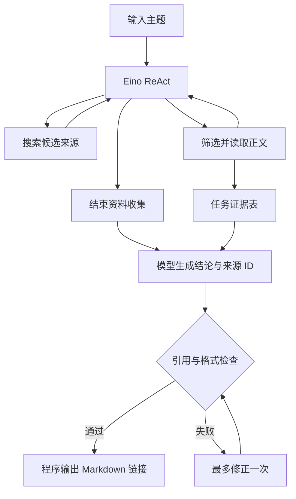

# ch2-docAgentDemo：最小资料研究助手

输入研究主题，程序自动搜索、筛选网页、读取正文，再输出带可点击来源的中文总结。

对应 [Agent Learning Hub 的 Stage 2](https://datawhalechina.github.io/Agent-Learning-Hub/) 最终产出。使用 **Eino ReAct Agent + DeepSeek + Tavily**，工具循环由 Eino 实现。

## 1. 放到 BoloAgent 并运行

将整个 `ch2-docAgentDemo` 文件夹放到 `C:\Code\BoloAgent` 下。

这是一个独立的 Go module，固定 Eino `v0.9.20`、DeepSeek 适配器 `v0.1.7`，避免修改前面章节的依赖。需要 **Go 1.24 或更高版本**。如果项目已有 `go.work` 且运行提示模块未包含在工作区，可在当前 PowerShell 执行 `$env:GOWORK="off"`，让本章独立运行。

在 PowerShell 中：

```powershell
cd C:\Code\BoloAgent\ch2-docAgentDemo

$env:DEEPSEEK_API_KEY="你的 DeepSeek Key"
$env:DEEPSEEK_BASE_URL="https://api.deepseek.com"
$env:DEEPSEEK_MODEL="deepseek-chat"
$env:TAVILY_API_KEY="你的 Tavily Key"

go mod download
go run . "Eino ReAct Agent 与手写 Agent Loop 有什么区别？"
```

也可省略主题，程序会提示输入，或者同时保存 Markdown：

```powershell
go run .
go run . -out report.md "RAG 中引用校验与证据一致性校验的区别"
```

`-out` 要写在主题之前。Ctrl+C 可以取消任务，整个研究最多运行 3 分钟。

配置说明：

| 环境变量 | 用途 | 是否必填 |
| --- | --- | --- |
| `DEEPSEEK_API_KEY` | 模型认证 | 是 |
| `DEEPSEEK_BASE_URL` | 模型接口地址，可继续使用你自己的兼容服务地址 | 默认官方地址 |
| `DEEPSEEK_MODEL` | 支持 Tool Calling 的模型 | 默认 `deepseek-chat` |
| `TAVILY_API_KEY` | 搜索与网页正文提取 | 是 |

Tavily Key 在 [Tavily 控制台](https://app.tavily.com/) 获取。搜索和提取都会消耗该服务的配额。本程序只读取系统环境变量，**不会自动加载 `.env.example` 或 `.env`**。配置 Key 时不要提交到 Git。

本例直接使用网页作为证据，因此不需要 Qwen Embedding 或向量数据库。

## 2. 阅读顺序与文件职责

建议先读 `prompt.go` 看任务要求，然后按照下面的顺序阅读源码：

| 顺序 | 文件 | 重点 |
| --- | --- | --- |
| 1 | `main.go` | CLI、环境变量、全局超时、创建两个模型实例 |
| 2 | `agent.go` | `react.NewAgent`、`ToolsNodeConfig`、工具 Middleware、研究与写作分离 |
| 3 | `tools.go` | `utils.InferTool`、输入 JSON Schema、两个工具、预算与正文截断 |
| 4 | `tavily.go` | 真正执行搜索/提取的 HTTP 请求，以及 HTTP 200 下的逐网页失败 |
| 5 | `evidence.go` | 来源编号、按 URL 去重、引用检查、Markdown 输出 |
| 6 | `demo_test.go` | 无 Key 测试，观察完整工具循环及失败分支 |

所有业务代码在同一个 `package main`，避免为了这个学习 Demo 建立多层接口。

## 3. 完整流程



图中的修正最多一次由 `agent.go` 中的两次生成上限保证。第二次仍失败，程序返回错误。

**搜索与筛选由 Agent 决策。** `search_web` 返回候选网页和摘要，模型决定读取哪些 `source_id`。程序没有写死关键词，也没有按一个相似度阈值自动认定资料可信。Prompt 要求优先官方文档、论文等一手来源，但这个来源质量判断仍是模型决策。

**收集和写作分两步。** 研究模型允许调用工具；写作模型只接收成功提取的正文，输出结构化 JSON。两个实例使用同一个 DeepSeek 配置，并不是两个协作 Agent。这样无需从 ReAct 的内部历史中重新抽取证据，也避免让工具失败消息或中间猜测参与总结。

## 4. 新的 Eino 抽象怎么理解

### `utils.InferTool`

把 `func(context.Context, *searchInput) (*searchOutput, error)` 变为 Eino `InvokableTool`。它负责从 struct/tag 建立参数 JSON Schema，并完成工具参数与输出的 JSON 转换。工具内部只需要关注业务。

`jsonschema:"required"` 告诉模型这个字段必填；它不替代业务检查，所以代码仍检查空关键词和未知来源。

### `compose.ToolsNodeConfig`

声明 Agent 能使用哪些工具。`ExecuteSequentially: true` 让一次模型返回的多个调用按顺序执行，这样任务状态中的普通 map 不需要并发锁。若改成并行调用，要同步证据表、计数器和缓存。

### `react.NewAgent` / `Generate`

`NewAgent` 注册工具并构建模型与工具之间的循环。`Generate` 负责把 ToolCall 交给工具、追加对应 ToolMessage，再调用模型，直到模型停止调用工具或达到上限。无需你手动解析分发，也无需直接调用 `BindTools`。

`MaxStep: 20` 是 Graph 执行步数，**不是允许 20 次工具调用**；模型节点和工具节点都会消耗步数。另外程序还限制实际 API 请求最多搜索 2 次、读取 4 次，失败请求也计入预算。

### `ToolCallMiddlewares`

Eino 在工具执行前后调用的包装层。本例在这里实现：参数 Object 检查、重复调用限制、只读缓存、25 秒单工具超时、执行日志和普通错误转 Observation。模型能看到错误并尝试调整。

全局取消继续返回 `error`，不包装成可恢复结果。这里没有审批/HITL 工具；以后添加这种特殊控制流，需要保留对应中断错误，不能照搬“所有错误转文本”。

## 5. 引用链如何形成

一次搜索把 URL 注册为 `S1`、`S2` 等编号。相同网页的不同 `#fragment` 使用同一编号。编号由程序分配；`read_source` 只接受这些编号，不能任意访问模型编造的 URL。

只有成功读取后，来源才具有 `content` 并进入写作上下文。每页最多保留 6000 个 Unicode 字符，存储与模型观察的片段一致。

写作输出示意：

```json
{
  "findings": [
    {"text": "一条由来源正文支持的结论", "source_ids": ["S1"]}
  ],
  "limitations": ["当前资料不足以确认的方面"]
}
```

程序依次检查：JSON 能否解析、结论是否非空、每条结论是否有引用、来源 ID 是否存在、对应正文是否成功读取。然后从证据表查出 URL 生成 Markdown 链接，仅列出实际引用的来源。

**这不是语义一致性校验。** `S1` 存在且正文已读取，仍不代表它支持模型的结论。Prompt 约束能减少错误，但不能证明正确。本例把可追溯的证据链做好，重要结论由读者打开原文核对；下一步可以添加逐结论 Grounding Evaluator。

## 6. 失败时会发生什么

| 场景 | 行为 |
| --- | --- |
| 搜索没有结果 | 工具明确返回 `status: empty`，Agent 可改关键词 |
| 网页提取失败/HTTP 429 | Middleware 返回错误 Observation，可换来源；不做后台无限重试 |
| 同样工具和参数第二次调用 | 成功结果从当前任务缓存复用，不额外发请求 |
| 同样调用第三次出现 | 返回 `blocked`，防止无效循环 |
| 没有任何网页正文 | 程序直接说明无法形成有依据的总结，不调用写作模型 |
| 引用不存在/未读来源 | 校验拒绝，并允许模型修正一次 |
| 达到 ReAct 步数上限/模型 API 失败 | 返回错误，本次研究结束 |
| 全局超时/Ctrl+C | Context 取消后停止，不伪装为工具成功 |

日志输出到 stderr，报告输出到 stdout；日志不打印 API Key 或完整网页正文。

## 7. 验证与练习

```powershell
go test ./...
go vet ./...
go build ./...
```

测试用本地 HTTP 服务模拟 DeepSeek 和 Tavily，实际经过 Eino ReAct、工具 JSON 转换和 Middleware。无需真实 Key，不消耗 API 配额。它验证链路和故障处理，不等于真实模型的研究质量评测。

可以按顺序试这几件事：

1. 正常研究一个范围小的主题，观察搜索与正文读取日志，核对结论的来源。
2. 降低 `maxReads`，观察证据减少对总结的影响。
3. 看 `TestReportValidation`，理解编号存在与正文可引用之间的区别。
4. 修改测试中的写作结果为不存在的 `S999`，观察一次修正和最终拒绝。

这个目标产出只聚焦搜索、筛选、总结、引用，不包含 RAG 数据入库、会话持久化、多 Agent 或长期记忆。任务结束后证据表释放，下次研究重新收集。

## 8. 官方参考

- [Agent Learning Hub 源码中的 Stage 2](https://github.com/datawhalechina/Agent-Learning-Hub#stage-2-learn-tool-use-rag-and-memory)
- [Eino ReAct Agent 使用说明](https://www.cloudwego.io/docs/eino/core_modules/flow_integration_components/react_agent_manual/)
- [Eino DeepSeek 适配器](https://github.com/cloudwego/eino-ext/tree/main/components/model/deepseek)
- [Tavily Search API](https://docs.tavily.com/documentation/api-reference/endpoint/search)
- [Tavily Extract API](https://docs.tavily.com/documentation/api-reference/endpoint/extract)
